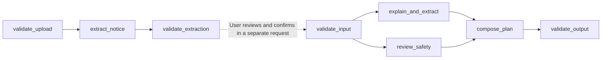

# Daywell

Daywell is a Hindi-first daily organizer for the **AI For Senior Citizens** challenge. Read a photographed notice, review the words, understand the message and its cautions, follow a step, then explicitly save a plan and return to it.

- Public repository: https://github.com/deevyanshoo/promptwars-main
- Main service: `promptwars-main`, Cloud Run, `asia-south1`. Public URL pending deployment verification.
- Node.js 22, vanilla HTML/CSS/JavaScript, `@google/genai` 2.23.0. Only branch `main`.
- The separate warmup repository and service are unchanged. No event form is submitted automatically.

## Working features

Choose one JPEG, PNG or WebP, preview it locally and explicitly request extraction. The browser prepares a bounded image. Gemini transcribes it in its original language and identifies uncertainty. Review and edit the text, confirm review, then request a plan. Pasting and optional dictation are complete alternatives. Synthetic ordinary and suspicious-message examples use the real model workflow.

A plan contains an attributed explanation, cautions, essential questions, up to five ordered steps and optional preparation. Guided mode shows one step with Listen, Done, Undo, Back, Next and overview controls. Completion records the user's confirmation, never an external action. A clarification reruns both independent planning branches with the reviewed message.

Explicit Save keeps approved plan content, user-selected dates and completion in browser localStorage. Resume after reload, undo, delete, manual tasks and confirmed clear-data are supported. No inferred deadline is saved. Opening the page shows overdue, due-today and upcoming counts and a next useful action. There are no background reminders. Raw source messages and images are not persisted. Existing `daywell.v1` tasks are safely migrated. Invalid stored data is preserved until the user clears it; blocked storage and quota failures are visible.

Hindi is the first-visit language. English switching and larger text persist. Saved content is not translated when the interface changes. Explicit translation keys cover controls and states. The interface uses 20px text, large native controls, visible focus, safe text rendering, mobile layout and reduced-motion support.

## Actual executable DAGs



`lib/dag.mjs` schedules declared dependencies, rejects duplicate IDs, missing dependencies and cycles, and runs ready independent nodes concurrently. Each node runs at most once with isolated request state and only its dependency outputs. Failed required nodes block downstream composition. Actual node statuses and durations appear in a collapsed disclosure. No prompts, hidden reasoning or provider logs are exposed.

The two planning branches independently receive the original reviewed source and any user clarification. Structured model output is validated before deterministic composition. Substantial risk replaces candidate instructions with cautious verification steps and removes preparation. Advisory signals are not definitive fraud verdicts. The application neither fetches links nor contacts anyone. A separate extraction request ends before the human review boundary.

## Modules and limits

- `server.mjs`, `lib/http.mjs`: static route allowlist, HTTP limits, shared admission, sanitized error categories and security headers.
- `lib/gemini.mjs`: the isolated, injectable Vertex AI gateway.
- `lib/images.mjs`, `lib/contracts.mjs`, `lib/extraction.mjs`, `lib/workflow.mjs`: upload contracts, strict output validation and declared DAGs.
- `public/api.js`, `photo.js`, `voice.js`, `plans.js`, `render.js`, `i18n.js`: API, transient photo preparation, browser speech, validated persistence, focused rendering and keyed copy. `app.js` connects the controls.

Input is bounded to 4,000 characters plus an optional 800-character clarification. Original photos are limited to 12 MiB, 12,000px per edge and 48 million decoded pixels. Prepared images have a longest edge of 1,600px and a 3 MiB limit. The server validates canonical base64, permitted MIME, matching image signatures, supported dimensions and structural bounds. It accepts no remote URLs or PDFs and writes no photos to disk. Planning bodies are limited to 20 KB; extraction bodies to 4.3 MB.

Admission is shared across endpoints: two active workflows, four concurrent provider calls, 20 requests per minute per process. Each SDK call allows at most two attempts for transient HTTP failures. Calls have a 40-second timeout, workflows a 45-second deadline and HTTP requests a 50-second deadline. Planning allows 3,000 output tokens per branch; extraction 6,000. Malformed output is never a successful fallback. Cloud Run is capped at one instance, so process-local admission resets on restart.

## GenAI and browser speech

The only GenAI service used is **Google Gemini on Vertex AI**, configured model `gemini-3.8-flash`, global endpoint, `vertexai: true`, thinking level `LOW`, SDK **2.23.0**. Photo extraction makes one logical call. Planning makes two parallel logical calls. There is no separate translation call. Navigation, saving, completion and due-date cues are deterministic and make no model calls.

Browser SpeechRecognition and SpeechSynthesis are separate browser features, not Gemini audio understanding. Dictation uses `hi-IN` or `en-IN`, starts on a click, appends editable text and never submits automatically. The browser may use its own online service. Read aloud chooses a matching-language voice, loads `voiceschanged`, cancels previous playback and provides Stop. Missing voices and denied or unsupported microphone access retain a visual/typing fallback. Audio stops on competing actions, navigation, language changes and leaving the page. Actual main-build checks and limitations are in `VERIFICATION.md`; the prior warmup microphone success is not presented as a new main-build live speech test.

## Run and test

Use Node.js 22 and existing Google Application Default Credentials outside Git:

```sh
npm ci
export GOOGLE_CLOUD_PROJECT=promptwars-divyanshu-260919
export GOOGLE_CLOUD_LOCATION=global
export GEMINI_MODEL=gemini-3.8-flash
npm start
npm test
```

Open http://localhost:8080. `PORT` is supported; the server binds `0.0.0.0`. `GET /health` reports `APP_COMMIT` without calling Gemini. No login or database is required.

## Deploy

```sh
gcloud run deploy promptwars-main \
  --source . --project promptwars-divyanshu-260919 --region asia-south1 \
  --build-service-account projects/promptwars-divyanshu-260919/serviceAccounts/promptwars-build@promptwars-divyanshu-260919.iam.gserviceaccount.com \
  --service-account promptwars-runtime@promptwars-divyanshu-260919.iam.gserviceaccount.com \
  --allow-unauthenticated --min 0 --max 1 --cpu 1 --memory 512Mi --cpu-throttling \
  --concurrency 8 --timeout 60 \
  --set-env-vars GOOGLE_CLOUD_PROJECT=promptwars-divyanshu-260919,GOOGLE_CLOUD_LOCATION=global,GEMINI_MODEL=gemini-3.8-flash,APP_COMMIT=YOUR_COMMIT
```

Only package manifests, Dockerfile, server, library and public assets enter deployment uploads. Credentials, dependencies, recordings, screenshots and local environments are excluded. The container runs as non-root. Restrictive CSP, same-origin POST checks and textContent rendering remain in place.

## Assumptions and limitations

This is a bounded public demonstration, not a production emergency, medical, financial or fraud-detection service. Gemini can misread images, miss risk indicators or offer unsuitable advice. Confirm important details independently. User review cannot guarantee accuracy. Browser storage is specific to a profile, accessible to people using it and not synchronized or encrypted by Daywell. Google processes submitted content; no infrastructure-level zero-retention promise is made. Application logs omit messages, photos and provider content, while managed infrastructure may retain metadata. Provider cancellation cannot guarantee remote compute stops.

Optional live camera help sessions, simulated SOS, emergency dispatch, mobile apps and calendar export are not implemented. The core is prioritized for deployment. See `VERIFICATION.md`, `DEMO.md` and `SUBMISSION.md` for evidence and submission review materials.
